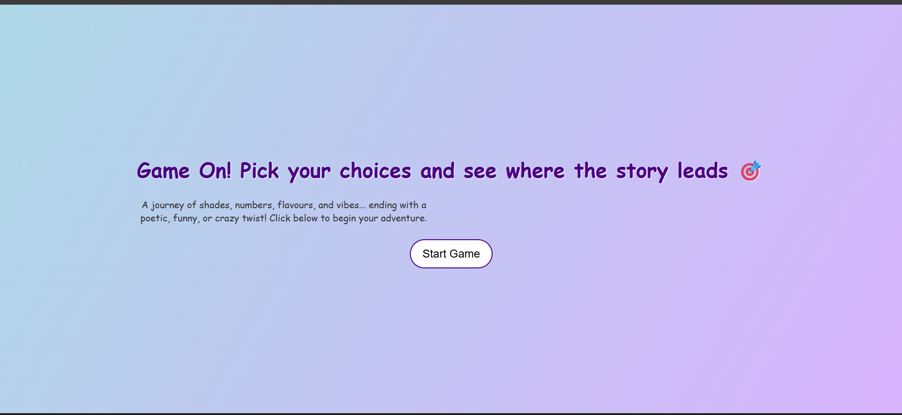
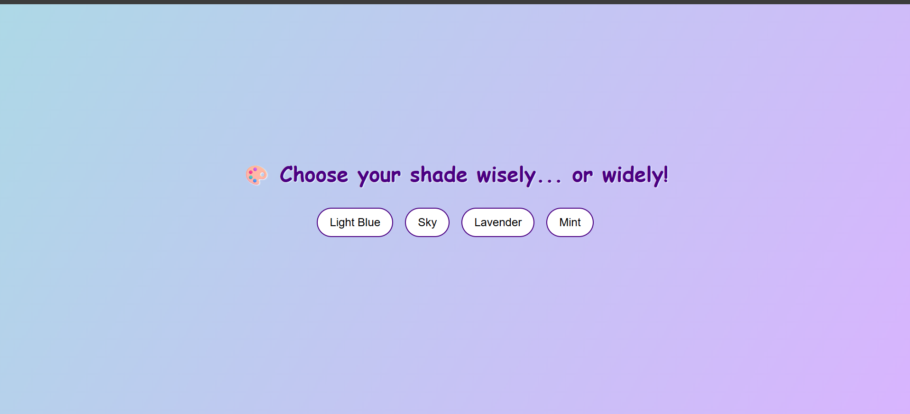
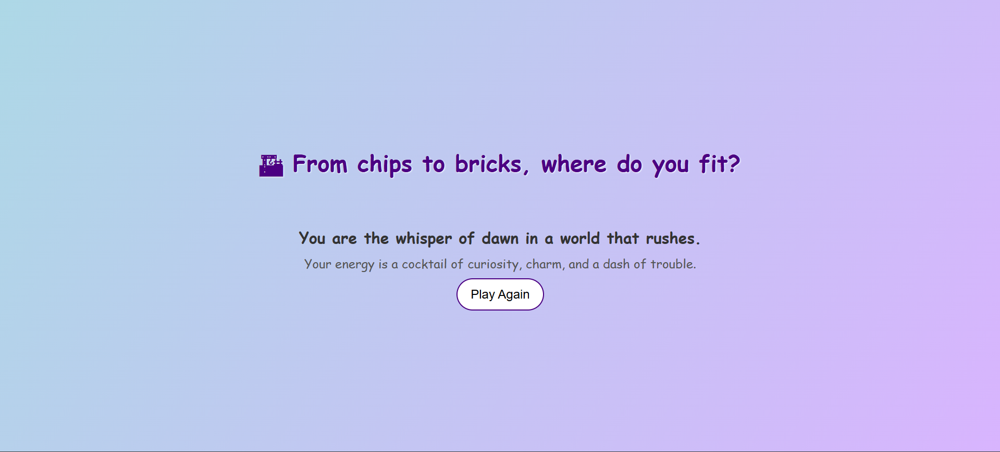

# Choice Quest 🎯

## Basic Details
### Team Name: Ecopair

### Team Members
- Team Lead: Annmary Roy- Government Engineering College Palakkad
- Member 2: Anusree Aravind - Government Engineering College Palakkad

### Project Description
Choice Quest is a fun game in which a player has to choose among a given set of options, at the end of which, based on his choice a small funny yet meaningful description on him will be given.

### The Problem (that doesn't exist)
The children of today's fast moving digital era are not interested in playing paper games. 

### The Solution (that nobody asked for)
So to give todays generation a glance of such games we haved designed a digital version. 

## Technical Details
### Technologies/Components Used
For Software:
- HTML,CSS,JAVASCRIPT
- 
- Tools used: Chatgpt- OpenAI
- 

# Screenshots (Add at least 3)

HOME PAGE: The entry point of the website.

The ame moves on

The game ends and the result displays

### Project Demo
# Video
demovideo.mp4
How the website works

## Team Contributions
- Annmary Roy: Developer
- Anusree Aravind: Developer
- 
---
Made with ❤️ at TinkerHub Useless Projects 

